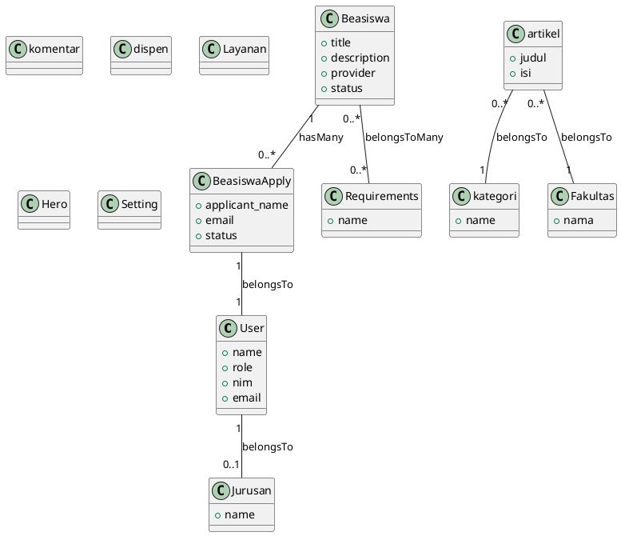

# Class Diagram

```plantuml
@startuml

class User {
  +name
  +role
  +nim
  +email
}

class Jurusan {
  +name
}

class Beasiswa {
  +title
  +description
  +provider
  +status
}

class BeasiswaApply {
  +applicant_name
  +email
  +status
}

class Requirements {
  +name
}

class artikel {
  +judul
  +isi
}

class kategori {
  +name
}

class Fakultas {
  +nama
}

class komentar
class dispen
class Layanan
class Hero
class Setting

User "1" -- "0..1" Jurusan : belongsTo
Beasiswa "1" -- "0..*" BeasiswaApply : hasMany
Beasiswa "0..*" -- "0..*" Requirements : belongsToMany
BeasiswaApply "1" -- "1" User : belongsTo
artikel "0..*" -- "1" kategori : belongsTo
artikel "0..*" -- "1" Fakultas : belongsTo

@enduml
```
